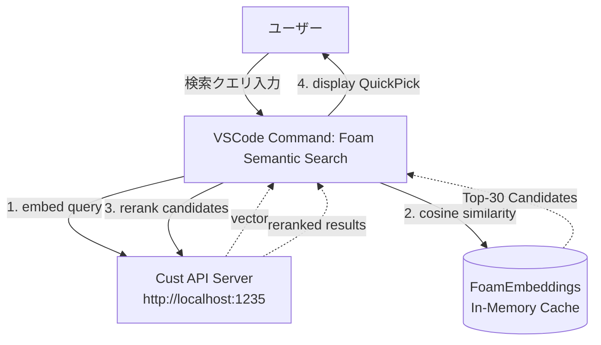

# Foam + Cust Embedding/Reranker 統合設計書

本ドキュメントは、VSCode拡張機能「Foam」の内部実装を拡張し、ローカルで稼働している `embed_reranker` APIサーバー（Cust Embedding / Reranker）を用いたセマンティック検索機能を実装するための設計をまとめたものです。

## 1. 背景と目的
Foamは試験的にAI機能（Ollamaを利用したローカルの埋め込み）をサポートし始めましたが、コサイン類似度のみの単純な検索であり、精度に限界があります。
そこで、専用APIサーバーへ接続し、**「初期検索（ベクトル検索）＋再ランキング（Cross-Encoder）」の2段構えの高精度なセマンティック検索機能**をFoam内に構築します。

## 2. アーキテクチャ

## 3. 実装モジュール

### ① `CustEmbeddingProvider`
- **役割**: Foam内の `EmbeddingProvider` インターフェースを実装するクラス。
- **実装場所**: `packages/foam-vscode/src/ai/providers/cust/cust-provider.ts`
- **処理内容**:
  - `embed(text)`: サーバーの `/v1/embeddings` エンドポイントを叩き、テキストのベクトル表現を取得します。
  - バックグラウンドでFoamが各Markdownファイルの内容を自動的にこのProviderに渡し、ベクトル化してキャッシュします。

### ② `FoamEmbeddings` の拡張
- **役割**: 検索クエリ用のベクトルを取得するヘルパーを追加。
- **実装場所**: `packages/foam-vscode/src/ai/model/embeddings.ts`
- **処理内容**:
  - `getQueryEmbedding(query)`: ユーザーの入力クエリのベクトル表現を取得するメソッドを追加します。
  - `search(query)`: ユーザーの入力クエリのベクトルを用いて、類似度順のノート一覧を取得するメソッドを追加します。

### ③ セマンティック検索コマンド機能 (`semantic-search.ts`)
- **役割**: VSCode上の検索UIと、検索パイプライン全体の制御。
- **実装場所**: `packages/foam-vscode/src/vscode/features/semantic-search.ts`
- **処理フロー**:
  1. ユーザーから検索ボックス(`window.showInputBox`)でクエリを受け取る。
  2. `FoamEmbeddings` を通じてクエリをベクトル化。
  3. ワークスペース内の全ノートから類似度上位30件を抽出（粗いフィルタリング）。
  4. 抽出した上位30件のノート本文を取得し、Cust API の `/v1/rerank` エンドポイントにクエリと共に送信。
  5. サーバーから返却された精緻なスコア順（Top 20件等）に並び替える。
  6. VSCodeの `QuickPick` インターフェースに検索結果として表示。選択すると該当ファイルを開く。

## 4. 期待される効果
* **高精度なセマンティック検索**: 単純なキーワード検索（grep）や通常のベクトル検索ではヒットしにくい、文脈や意味に基づいた検索が可能になります。
* **高速なレスポンス**: Rerankerは計算負荷が高いですが、事前にFoam内で維持されているベクトルキャッシュを用いて数十件に絞り込むため、全体の検索は非常に高速（数秒以内）に完了します。
* **柔軟なカスタマイズ**: VSCodeの設定から、URLやモデル名を自由に変更できます。
