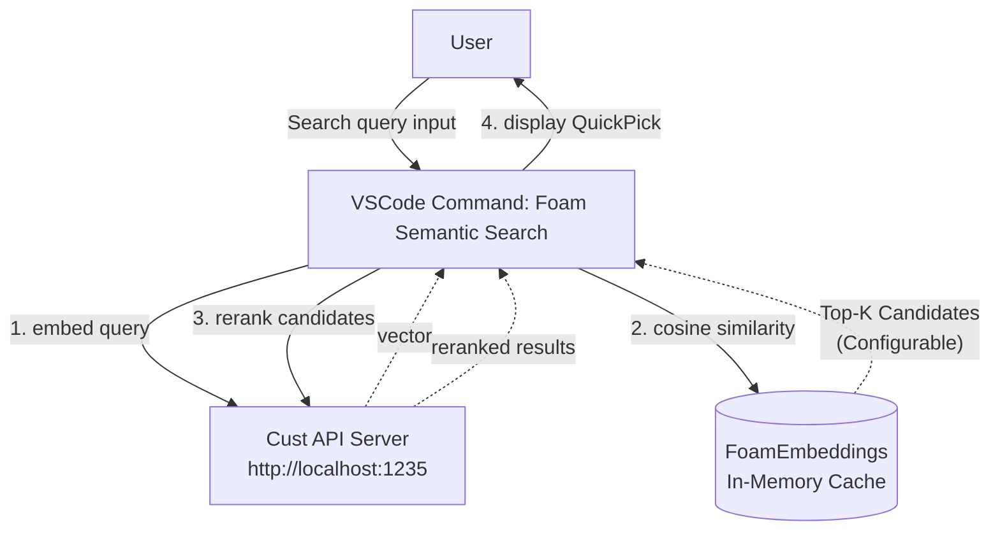

# Foam + Cust Embedding/Reranker Integration Design

[日本語版](Foam_Cust_Integration_Design_JA.md) | English

This document outlines the design for extending the VSCode extension "Foam" to implement high-precision semantic search using a locally running `embed_reranker` API server (Cust Embedding / Reranker).

## 1. Background and Purpose
Foam has started experimentally supporting AI features (local embeddings using Ollama), but this only provides simple cosine similarity search with limited accuracy. Therefore, we will build a high-precision semantic search feature within Foam that connects to a dedicated API server and uses a **"two-stage approach: initial search (vector search) + reranking (Cross-Encoder)"**.

## 2. Architecture

## 3. Implementation Modules

### ① `CustEmbeddingProvider`
- **Role**: Class implementing Foam's `EmbeddingProvider` interface.
- **Location**: `packages/foam-vscode/src/ai/providers/cust/cust-provider.ts`
- **Processing**:
  - `embed(text)`: Calls the server's `/v1/embeddings` endpoint to get the vector representation of text.
  - Foam automatically passes each Markdown file's content to this Provider in the background, vectorizes it, and caches it.

### ② Extension of `FoamEmbeddings`
- **Role**: Add helper for obtaining search query vectors.
- **Location**: `packages/foam-vscode/src/ai/model/embeddings.ts`
- **Processing**:
  - `getQueryEmbedding(query)`: Add method to get the vector representation of the user's input query.
  - `search(query)`: Add method to get a list of notes ordered by similarity using the vector of the user's input query.

### ③ Semantic Search Command Feature (`semantic-search.ts`)
- **Role**: VSCode search UI and control of the entire search pipeline.
- **Location**: `packages/foam-vscode/src/vscode/features/semantic-search.ts`
- **Processing Flow**:
  1. Receive query from user via search box (`window.showInputBox`).
  2. Vectorize the query through `FoamEmbeddings`.
  3. Extract top K notes by similarity from all notes in the workspace (coarse filtering). K is configurable via VSCode settings (default: 30).
  4. Retrieve the content of the top K notes and send them along with the query to the Cust API's `/v1/rerank` endpoint.
  5. Reorder based on the refined scores returned from the server.
  6. Display search results in VSCode's `QuickPick` interface. Selecting opens the corresponding file.

## 4. Configuration

The following parameters can be adjusted via VSCode settings (`settings.json`):

| Setting Key | Description | Default Value |
|-------------|-------------|---------------|
| `foam.semanticSearch.topK` | Number of candidates to extract in vector search (number of inputs to Reranker) | 30 |

This setting allows you to adjust the balance between search accuracy and performance:
- **Increase value**: Reranker selects from more candidates, potentially improving accuracy but increasing processing time
- **Decrease value**: Processing speed improves, but relevant notes may not be included in candidates

## 5. Expected Effects
* **High-precision semantic search**: Enables context and meaning-based search that is difficult to achieve with simple keyword search (grep) or regular vector search.
* **Fast response**: Although Reranker is computationally expensive, the overall search completes very quickly (within seconds) by filtering to dozens of items using the vector cache maintained in Foam.
* **Flexible customization**: URL, model name, candidate count (Top-K), etc. can be freely changed via VSCode settings.
